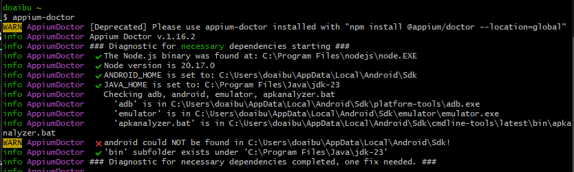
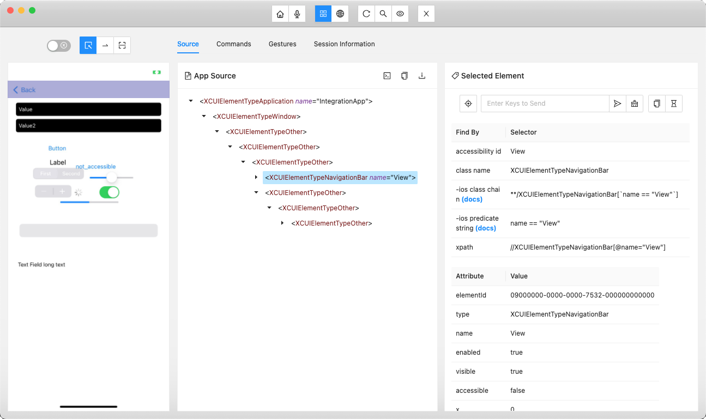
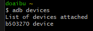
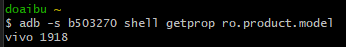
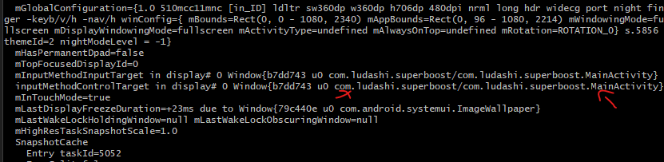
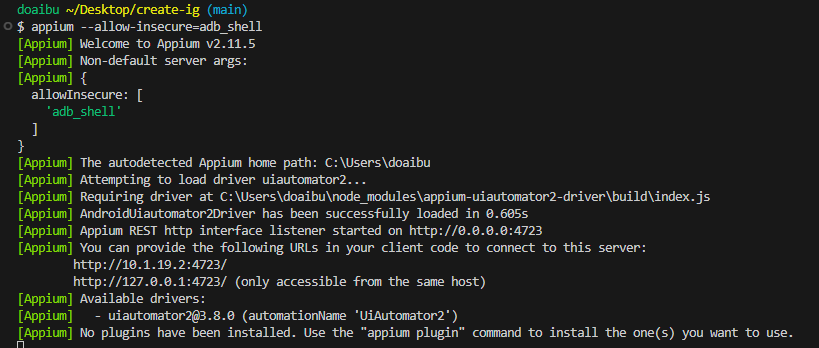

# Create Instagram Otomatis

Proyek ini bertujuan untuk mengotomatiskan tugas di aplikasi Instagram menggunakan Appium, WebdriverIO, dan Puppeteer. Dengan menggunakan berbagai modul dan alat ini, pengguna dapat mengendalikan perangkat Android dan melakukan pengujian atau tugas otomatisasi lainnya di aplikasi Instagram. Proyek ini dirancang untuk membantu pengguna dalam mengotomatisasi interaksi dengan aplikasi Instagram, seperti membuka aplikasi, mengisi formulir, dan melakukan navigasi di dalam aplikasi.

## Installation

Instal Appium

```bash
npm install appium

```

Instal Appium Doctor

```bash
npm install appium-doctor
```

Cek Konfigurasi Appium Doctor

```bash
appium-doctor
```



Install Appium Inspector

```bash
https://github.com/appium/appium-inspector/releases
```



Inisialisasi proyek Node.js dan instal puppeteer serta webdriverio:

```bash
npm init -y && npm i puppeteer webdriverio
```

## Mengimpor Modul

```javascript
const { remote } = require("webdriverio");
const puppeteer = require("puppeteer");
const readline = require("readline");
const fs = require("fs");
```

## Konfigurasi Capabilities Untuk Perangkat Android

```javascript
const capabilities = {
  platformName: "Android",
  "appium:deviceName": "vivo 1918",
  "appium:udid": "b503270",
  "appium:automationName": "UiAutomator2",
  "appium:ensureWebviewsHavePages": "true",
  "appium:nativeWebScreenshot": "true",
  "appium:newCommandTimeout": "3600",
  "appium:connectHardwareKeyboard": "true",
  "appium:appPackage": "com.ludashi.superboost",
  "appium:appActivity": "com.ludashi.superboost.MainActivity",
};
```

Cara Mengecek udid Devices nya :

```javascript
adb devices
```



Cara Mengecek deviceName :

```javascript
adb -s (masukan udid nya di sinih) shell getprop ro.product.model
```



Target aplikasi apa yg ingin di buka tinggal ketik : ( buka dulu aplikasinya lalu jalankan ini )

```javascript
adb shell dumpsys window windows
```



Jalankan server Appium di terminal dengan salah satu cara berikut :

```javascript
appium
appium -p 4723
appium --allow-insecure=adb_shell
```



Membuat File ( nama file.js ) isi dengan ini

```javascript
const { remote } = require("webdriverio");
const puppeteer = require("puppeteer");
const readline = require("readline");
const fs = require("fs");

const capabilities = {
  platformName: "Android",
  "appium:deviceName": "vivo 1918",
  "appium:udid": "b503270",
  "appium:automationName": "UiAutomator2",
  "appium:ensureWebviewsHavePages": "true",
  "appium:nativeWebScreenshot": "true",
  "appium:newCommandTimeout": "3600",
  "appium:connectHardwareKeyboard": "true",
  "appium:appPackage": "com.ludashi.superboost",
  "appium:appActivity": "com.ludashi.superboost.MainActivity",
};

const doaibu = {
  hostname: process.env.APPIUM_HOST || "0.0.0.0",
  port: parseInt(process.env.APPIUM_PORT, 10) || 4723,
  logLevel: "info",
  capabilities,
};

async function instagram() {
  let driver;
  try {
    // Tambahkan kode otomatisasi Anda di sini
  } catch (error) {
    throw new Error(error);
  }
}
```

Contoh kode otomatisasi di dalam try catch

```javascript
driver = await remote(doaibu);
async function programDilanjutkan(driver) {
  const packageName = "com.ludashi.superboost";
  await driver.pressKeyCode(3);

  await driver.execute("mobile: shell", {
    command: "pm clear",
    args: [packageName],
    includeStderr: true,
    timeout: 5000,
  });

  throw new Error();
}
const startTimeSeluruh = new Date();
const fileName = "nama.txt";
if (!fs.existsSync(fileName)) {
  fs.writeFileSync(fileName, "", "utf-8");
}

const doaibuNama = fs
  .readFileSync("nama.txt", "utf-8")
  .split("\n")
  .filter(Boolean);
const email = doaibuNama.map(
  (nama) => nama.replace(/\s+/g, "").toLowerCase() + "@akunlama.com"
);
const sandi = doaibuNama.map(
  (nama) => nama.replace(/\s+/g, "").toLowerCase() + "*"
);

try {
  const buttonAgree = await driver.$(
    'android=resourceId("com.ludashi.superboost:id/btn_start")'
  );
  await buttonAgree.waitForDisplayed({ timeout: 10000 });
  await buttonAgree.click();
} catch (e) {
  throw new Error();
}

try {
  const gridView = await driver.$(
    'android=resourceId("com.ludashi.superboost:id/iv_appicon")'
  );
  await gridView.waitForDisplayed({ timeout: 10000 });
  await gridView.click();
} catch (e) {
  throw new Error();
}
```
